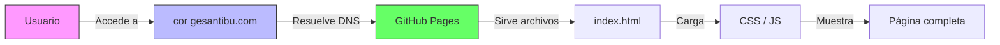

<div align="center">

# 🎓 Corporación Educativa General Santander

### Sucursal Tibú - Norte de Santander

[](https://corgesantibu.com)
[](https://corgesantibu.com)
[](LICENSE)

<br>

[](https://corgesantibu.com)

</div>

---

## 📖 Descripción del Proyecto

Plataforma web institucional moderna y optimizada para la **Corporación Educativa General Santander**. Diseñada para facilitar la inscripción a programas técnicos laborales, gestionar becas y ofrecer información clara a la comunidad del Catatumbo.

> ✨ **Desarrollado por:** [Tibutec](https://tibutec.github.io/Tibutec/)

---

## 🚀 Características Principales

* 🎨 **Diseño Moderno:** UI/UX limpia, animaciones suaves y totalmente **Responsive** (Móvil/Tablet/Desktop).
* 🔍 **SEO Avanzado:** Optimizado para Google (Meta tags, JSON-LD, Sitemap, Robots.txt).
* 💬 **Enfoque en Conversión:** Botones directos a WhatsApp para inscripciones.
* ⚡ **Alto Rendimiento:** Carga rápida, imágenes lazy-load y código modular.
* 🔒 **Seguridad:** Certificado SSL (HTTPS) y buenas prácticas de desarrollo.

---

## 🛠️ Tecnologías Utilizadas

| Componente | Tecnología |
|:---:|:---:|
| **Frontend** |    |
| **Iconos** |  |
| **Hosting** |  |
| **Dominio** |  |

---

## 📊 Diagrama de Funcionamiento



---

## 📂 Estructura del Proyecto

```text
Corporaciongs/
├── 📄 index.html           # Web principal
├── 🎨 css/
│   └── style.css           # Estilos y variables CSS
├── ⚙️ js/
│   └── main.js             # Lógica del sitio
├── 🤖 robots.txt           # Configuración de rastreo Google
├── 🗺️ sitemap.xml          # Mapa del sitio
├── 🏷️ CNAME                # Vinculación del dominio personalizado
└── 📚 README.md            # Documentación
```

---

## 📈 SEO y Dominio

* **Dominio:** `https://corgesantibu.com`
* **DNS:** Configurado vía Namecheap → GitHub Pages (registros A y CNAME).
* **Indexación:** Preparado para Google Search Console con datos estructurados (`Organization`, `EducationalOrganization`).

---

<div align="center">
<br>
<p>Desarrollado con ❤️ por <strong>Tibutec</strong></p>
<p>
  <a href="https://tibutec.github.io/Tibutec/">🌐 Web Tibutec</a> •
  <a href="mailto:contacto@tibutec.com">📧 Contacto</a>
</p>
</div>
